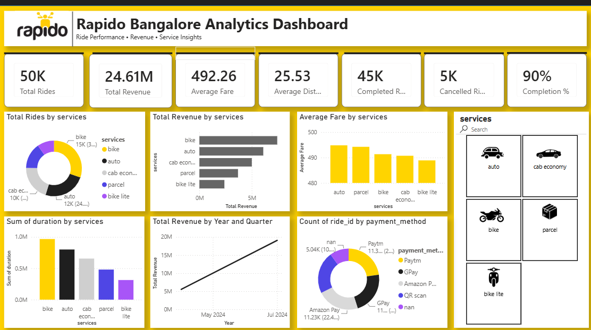

# 🚖 Rapido Bangalore Analytics Dashboard

Interactive Power BI dashboard built using Power BI, DAX and Power Query to analyze Rapido Bangalore ride performance, revenue trends, payment methods and service-wise insights.

---

## Dashboard Preview

---

## Features

- 📊 Total Rides KPI
- 💰 Total Revenue
- 💵 Average Fare
- 📍 Average Distance
- ✅ Completed Rides
- ❌ Cancelled Rides
- 📈 Completion Percentage
- 🚖 Service-wise Ride Analysis
- 💳 Payment Method Analysis
- ⏱ Ride Duration Analysis
- 📅 Revenue Trend Analysis
- 🎛 Interactive Service Filter

---

## Tools Used

- Microsoft Power BI
- Power Query
- DAX
- Microsoft Excel / CSV

---

## Dataset

The dataset contains:

- Ride Status
- Service Type
- Date & Time
- Source
- Destination
- Distance
- Duration
- Ride Charge
- Misc Charge
- Total Fare
- Payment Method

---

## Business Insights

- Bike rides contribute the highest number of rides.
- Average fare varies across service types.
- Digital payment methods dominate transactions.
- Ride completion rate is approximately 90%.

---

## Author

Tvisha Choudhary
